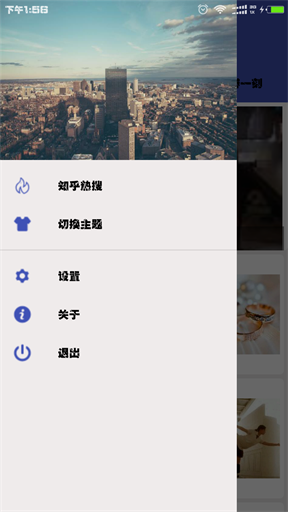
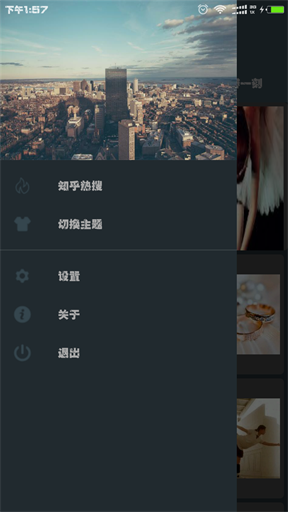
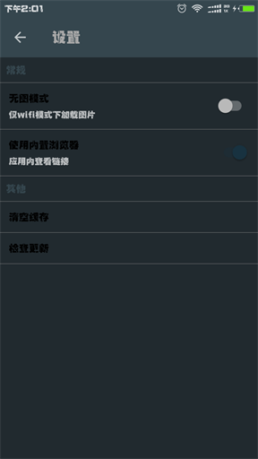

# DailyNews
一款基于开源新闻数据的新闻类APP。  

### 一、简介
DailyNews是一款新闻资讯类App,主要包含知乎热搜、果壳精选、豆瓣一刻中的热点新闻。该项目的目的主要用练习使用MaterialDesign+Mvp+Retorfit+Rxjava+Glide等最新的Android开发技术来进行开发。

### 二、主要内容
1. 资讯,资讯详情
	
	主要练习使用Retrofit+Rxjava来获取网络数据，并显示到RecyclerView上。  
		重点是头轮播图的显示以及RecyclerView显示不同布局

2. 夜间模式  

	主要通过Android自带API进行夜间模式，
		AppCompatDelegate.setDefaultNightMode(AppCompatDelegate.MODE_NIGHT_NO)，然后重新启动;
		存在的主要问题是会重新加载数据以及闪屏

3. 新闻缓存

	 App默认会进行新闻数据的缓存，在没有网络的时候依然可以显示。

4.混淆

     学习混淆相关概念，以及对应用混淆的规则

### 三、截屏
 * 白天模式

	 
 
	  

 * 夜晚模式

	   

	   

### 四、使用

